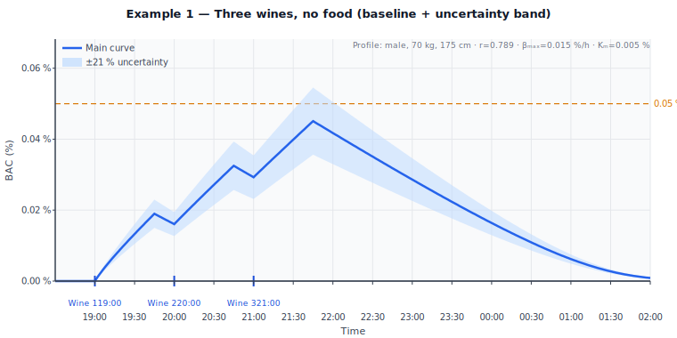
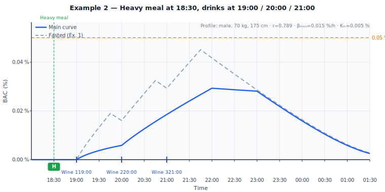
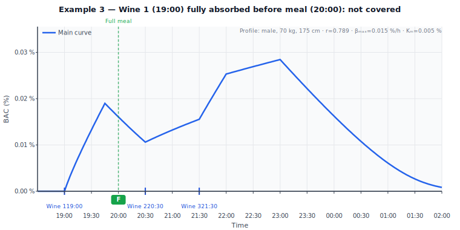
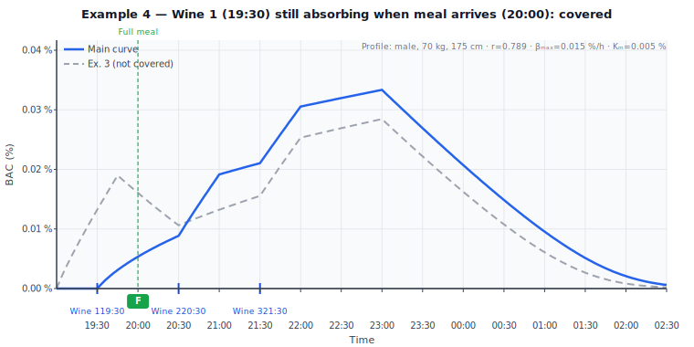
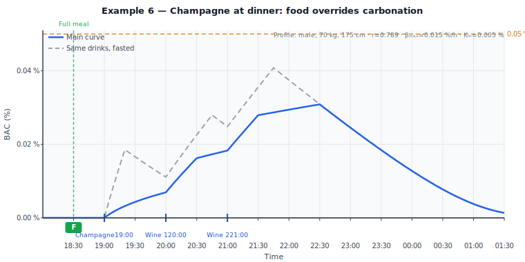

# Alculator — Absorption Model Explained

*Version 1.0 — 2026-02-22*

This document describes the pharmacokinetic model used by Alculator to estimate
Blood Alcohol Content (BAC) over time, explains the rationale behind each
parameter choice, and works through six examples with curve images.

---

## Table of Contents

1. [Purpose of This Document](#1-purpose-of-this-document)
2. [The BAC Equation](#2-the-bac-equation)
3. [Food Effects on Absorption](#3-food-effects-on-absorption)
4. [Known Simplifications](#4-known-simplifications)
5. [Worked Examples](#5-worked-examples)
6. [Summary: When Does Food Protect?](#6-summary-when-does-food-protect)

---

## 1. Purpose of This Document

Alculator estimates how BAC changes over an evening of drinking. The calculation
is more nuanced than a single Widmark formula because it must handle:

- **Multiple drinks** consumed at different times
- **Gradual absorption** (each drink takes time to enter the bloodstream)
- **Food effects** (meals slow absorption and slightly reduce bioavailability)
- **Carbonation effects** (CO₂ accelerates absorption)
- **Michaelis-Menten elimination** (the body removes alcohol at a rate that
  depends on current BAC level)

This document explains each component, identifies where our model departs from
the simplest textbook formulas and why, and demonstrates the combined behaviour
through six worked examples with BAC curve images.

**Notation:** BAC values throughout are in % w/v (grams per 100 mL blood).

---

## 2. The BAC Equation

### 2.1 Ethanol Dose

Each drink contributes a mass of ethanol:

```
ethanol_g = volume_mL × (ABV / 100) × 0.789
```

where **0.789 g/mL** is the density of ethanol at 20 °C.

**Example:** A 150 mL glass of 12 % wine:

```
ethanol_g = 150 × 0.12 × 0.789 = 14.20 g
```

### 2.2 The Seidl r Factor

The fraction of body mass that ethanol distributes into is captured by the
Widmark *r* factor. Alculator uses the **Seidl formula** (Seidl et al. 2000),
which derives an individualised *r* from height, weight, and sex:

```
r_male   = 0.32 − 0.0048 × Weight_kg + 0.0046 × Height_cm
r_female = 0.31 − 0.0064 × Weight_kg + 0.0045 × Height_cm
```

Seidl's formulas showed "clearly higher congruence" between calculated and
measured BAC than fixed-*r* approaches in controlled drinking experiments
(RESEARCH.md §8.3). They require only height, weight, and sex — all inputs
already in the Alculator profile.

**Example:** Male, 70 kg, 175 cm:

```
r = 0.32 − 0.0048 × 70 + 0.0046 × 175 = 0.789
```

### 2.3 Absorption Function

#### 2.3.1 Instantaneous Model (duration = 0)

Alcohol is not absorbed instantly. Alculator models absorption as a **linear
ramp** from 0 to 100 % over a drink-specific absorption time T_absorb.  When
the drink is assumed to be consumed instantaneously (the default for legacy
data and for shots), the absorbed fraction at time *t* is:

```
f(t) = clamp( (t − t_start) / T_absorb,  0,  1 )
```

| Condition | T_absorb | Rationale |
|-----------|----------|-----------|
| Fasted, non-carbonated | 45 min | Within the 30–60 min fasted peak range (RESEARCH.md §1.2) |
| Fasted, carbonated | 20 min | Ridout et al. 2003: champagne BAC peaks faster in the first 20 min (RESEARCH.md §1.4) |
| With snack | 60 min | Mild slowing of gastric emptying |
| With light meal | 75 min | Moderate slowing |
| With full meal | 90 min | Within the 60–360 min fed range |
| With heavy meal | 120 min | Extended gastric retention |

#### 2.3.2 Extended-Duration Model (duration > 0)

In reality, most drinks are consumed over several minutes to half an hour.
Treating the dose as instantaneous introduces two systematic errors:

1. **Early absorption is missed**: the first sip starts being absorbed
   immediately, not at the midpoint of the drinking window.
2. **Late completion is too early**: the last sip finishes absorbing
   `duration/2` minutes earlier than the instantaneous model predicts,
   causing the BAC to peak sooner and fall off sooner than it really does.

The error in peak BAC magnitude is typically small (≤ 5 % of peak for
`duration ≤ T_absorb / 2`), but the timing error is `duration / 2` minutes,
which is significant when comparing curves across scenarios.

**The exact solution** treats ethanol as entering the stomach at a **constant
rate** while the drink is being consumed (from `t_start` to `t_start + D`
where D = `duration_min`).  Each "sip" at time `s` starts its own T_absorb
ramp.  The resulting absorbed fraction is the convolution of the uniform
intake rate with the linear absorption ramp, which has an **exact closed-form**
via the antiderivative:

```
H(x, T) = ∫₀ˣ max(0, min(1, u/T)) du

         = 0              if x ≤ 0
         = x² / (2T)     if 0 < x ≤ T
         = x − T/2       if x > T
```

The absorbed fraction at elapsed time `t` (measured from the start of drinking):

```
f(t) = [ H(t, T_absorb) − H(t − D, T_absorb) ] / D
```

**Phase structure** (for the typical case D < T_absorb):

| Phase | Elapsed range | Absorbed fraction | Notes |
|-------|---------------|-------------------|-------|
| Quadratic rise | 0 to D | t² / (2DT) | First sips absorbing; last sips still being drunk |
| Linear middle | D to T | (t − D/2) / T | Identical to midpoint approximation — the two models agree exactly here |
| Quadratic fall | T to D+T | Decreasing curve approaching 1 | Last sips completing their absorption window |
| Fully absorbed | > D+T | 1.0 | Complete |

**Key properties:**
- Absorption begins at t = 0 (first sip), not at t = D/2.
- Absorption completes at t = D + T_absorb (last sip fully absorbed),
  D/2 minutes later than the midpoint approximation predicts.
- The formula reduces continuously to the instantaneous ramp as D → 0.
- No numerical integration: the formula is computed in O(1).

**Worked example** (D = 30 min, T_absorb = 45 min):

| Elapsed | Absorbed fraction | Via |
|---------|-------------------|-----|
| 0 min | 0 % | Before drinking starts |
| 15 min | 15² / (2×30×45) = 8.3 % | Quadratic phase |
| 30 min | 30 / (2×45) = 33.3 % | Transition; equals (t−D/2)/T = 15/45 |
| 45 min | (45−15) / 45 = 66.7 % | Linear phase (midpoint agrees) |
| 60 min | 91.7 % | Quadratic fall; midpoint says 100 % |
| 75 min | 100 % | D + T = 75 min — complete |

Midpoint model (dose at t = 15 min) says "done" at t = 15 + 45 = 60 min, but
8.3 % of the dose is still absorbing at that point in the exact model.

The linear ramp is still a simplification of the underlying first-order
exponential kinetics — but it matches time-to-peak and total dose constraints
adequately for an estimation tool (see §4.1).

### 2.4 Elimination: Michaelis-Menten Kinetics

#### Why Zero-Order Is Insufficient

The classical Widmark formula uses **zero-order** (constant-rate) elimination:

```
BAC_eliminated = β × hours_since_first_drink
```

where β = 0.015 %/h. This works well when BAC is above ~0.02 %, where the
hepatic enzyme ADH is fully saturated and operates at its maximum velocity
(V_max). RESEARCH.md §3.1 states:

> "The hepatic enzyme ADH has a very low Michaelis constant (Km ≈ 2–10 mg/dL).
> It is **fully saturated at BAC levels above ~15–20 mg/dL** (0.015–0.020 %).
> Only at very low BAC does the reaction shift toward first-order
> (Michaelis-Menten) kinetics."

The problem arises when food **slows absorption**. With T_absorb extended to
90–120 minutes, each drink's absorption rate becomes very low. Under strict
zero-order elimination, the constant β = 0.015 %/h can exceed the per-minute
absorption rate, making BAC perpetually clamp to zero — even for three glasses
of wine. This is physiologically unrealistic.

**Numerical proof of the failure:**

For a single 150 mL wine with a heavy meal (T_absorb = 120 min, factor = 0.90):

```
Absorption rate = (14.20 g × 0.90) / 120 min = 0.1065 g/min
BAC rise rate   = 0.1065 / (70000 × 0.789) × 100 = 0.000193 %/min

Zero-order elimination rate = 0.015 / 60 = 0.000250 %/min
```

Since 0.000193 < 0.000250, the absorption rate never exceeds the elimination
rate. BAC remains clamped at zero — the model predicts you cannot become
intoxicated from three glasses of wine with dinner. This is clearly wrong.

#### The Michaelis-Menten Solution

The fix is to use the full Michaelis-Menten equation, which models the actual
enzyme kinetics:

```
β_eff(BAC) = β_max × BAC / (BAC + Km)
```

| Parameter | Value | Meaning |
|-----------|-------|---------|
| β_max | 0.015 %/h | Maximum elimination rate (same as classical β) |
| Km | 0.015 % | BAC at which β_eff = β_max / 2 (half-saturation constant) |

**Behaviour at different BAC levels:**

| BAC | β_eff | % of β_max | Character |
|-----|-------|------------|-----------|
| 0.001 % | 0.0009 %/h | 6 % | Near-zero elimination — BAC can rise even with slow absorption |
| 0.005 % | 0.0038 %/h | 25 % | Slow elimination |
| 0.015 % (= Km) | 0.0075 %/h | 50 % | Half-maximal |
| 0.050 % | 0.0115 %/h | 77 % | Approaching zero-order |
| 0.080 % | 0.0126 %/h | 84 % | Effectively zero-order |
| 0.150 % | 0.0136 %/h | 91 % | Fully saturated |

At social-drinking BAC levels (> 0.03 %), M-M elimination is already > 67 % of
β_max, so results closely match the classical zero-order model. The difference
only matters at low BAC — exactly where food-slowed absorption operates. This
is directly supported by RESEARCH.md §3.1.

### 2.5 The Full Incremental Formula

Alculator computes BAC minute-by-minute using an incremental model:

```
Km        = 0.015    (% BAC; ADH half-saturation constant)
β_max     = 0.015    (%/h; maximum elimination rate at saturation)

BAC[0]    = 0
For each minute t = 1, 2, 3, …:

  ── Absorption increment ──
  For each drink i:
    f_i(t)     = clamp( (t − t_drink_i) / T_absorb_i,  0, 1 )
    Δf_i       = f_i(t) − f_i(t − 1)
    Δabsorbed  = ethanol_g_i × ethanol_factor_i × Δf_i

  ΔBAC_abs   = Σ Δabsorbed_i / (Weight_kg × 1000 × r) × 100

  ── Elimination decrement ──
  β_eff      = β_max × BAC[t−1] / (BAC[t−1] + Km)       ← Michaelis-Menten
  ΔBAC_elim  = β_eff / 60                                 ← per-hour to per-minute

  ── Update ──
  BAC[t]     = max(0,  BAC[t−1] + ΔBAC_abs − ΔBAC_elim)
```

This formula:
- Correctly handles multiple drinks at different times
- Allows BAC to rise even with very slow absorption (M-M elimination is weak
  at low BAC)
- Converges to the classical Widmark result at higher BAC levels
- Produces physiologically plausible curves for all combinations of food and
  drink timing

---

## 3. Food Effects on Absorption

### 3.1 How Food Slows Gastric Emptying

Food in the stomach slows gastric emptying through hormonal feedback
(cholecystokinin, GLP-1) and physical distension. This keeps alcohol in the
stomach longer, where:

1. **Absorption is slower** (stomach absorbs only ~20 % of ethanol vs. ~80 %
   in the small intestine — RESEARCH.md §1.1)
2. **Gastric first-pass metabolism (FPM) is increased** due to longer contact
   with gastric ADH enzymes

The net result is a lower, later BAC peak — typically 20–50 % lower than the
fasted peak for the same dose (RESEARCH.md §1.3).

### 3.2 T_absorb by Meal Size

| Meal size | T_absorb | Fasted T_absorb | Ratio |
|-----------|----------|-----------------|-------|
| Snack | 60 min | 45 min | 1.3× |
| Light meal | 75 min | 45 min | 1.7× |
| Full meal | 90 min | 45 min | 2.0× |
| Heavy meal | 120 min | 45 min | 2.7× |

The extended T_absorb is the **primary mechanism** by which food reduces peak
BAC. By spreading the same ethanol dose over a longer time, concurrent
elimination removes more alcohol before the peak is reached.

### 3.3 ethanol_factor — Incremental First-Pass Metabolism Only

The `ethanol_factor` represents the fraction of ethanol dose that reaches
systemic circulation after accounting for food-related incremental FPM.

**Critical design choice:** The ethanol_factor captures *only* the incremental
gastric FPM due to food — it does *not* represent the total peak BAC reduction.

| Meal size | ethanol_factor | Incremental FPM |
|-----------|----------------|-----------------|
| Snack | 0.97 | −3 % |
| Light meal | 0.95 | −5 % |
| Full meal | 0.92 | −8 % |
| Heavy meal | 0.90 | −10 % |

**Rationale:** Frezza et al. (1990) measured gastric FPM at ~5–10 % in fasted
non-alcoholic men (RESEARCH.md §4.2). Food increases gastric residence time,
raising FPM by an additional ~3–12 %. The remaining peak BAC reduction (to reach
the literature's 20–50 % total reduction) comes entirely from the extended
T_absorb allowing Michaelis-Menten elimination to remove more alcohol during
the slower absorption phase.

**Why not use larger factors?** Using ethanol_factor = 0.50 (as an earlier
draft did) combined with T_absorb = 120 min **double-counts** the food effect.
The extended absorption time already causes substantial peak reduction by
itself; applying a 50 % dose reduction on top produces a combined reduction
of nearly 100 %, making BAC stay at zero for realistic drinking scenarios.
This was verified numerically and is the motivation for the corrected values.

### 3.4 Food Coverage: Case A and Case B

A food event only affects drinks whose absorption overlaps with the food's
presence in the stomach. The coverage rule uses two cases:

**Case A — Food already in stomach when drink is consumed:**

```
t_food ≤ t_drink ≤ t_food + post_window
```

The drink arrives in a stomach already slowed by food. This is the
straightforward scenario (dinner, then drinks).

**Case B — Drink consumed before food, but still being absorbed when food
arrives:**

```
t_drink < t_food  AND  (t_drink + T_base) ≥ t_food
```

where T_base is the drink's *unmodified* fasted absorption time (45 min for
non-carbonated, 20 min for carbonated). The food arrives while the drink's
gastric emptying is still ongoing, so the remaining un-emptied alcohol gets
delayed by the food.

**Why not use a fixed pre-window?**

An earlier design used a fixed pre-window (e.g., 90 minutes before food).
This was incorrect because it could cover drinks that were **already fully
absorbed** before the food was eaten:

```
Example:  Drink at 18:30, food at 20:00, pre_window = 90 min
          18:30 ≥ 20:00 − 90 = 18:30 → "covered" ✗
          But: drink at 18:30 + 45 min = 19:15 (fully absorbed)
          Food at 20:00 arrives 45 minutes too late to affect this drink.
```

The physics-based Case B rule checks whether the drink is *still absorbing*
when food arrives — which is what actually matters biologically.

**Post-window by meal size:**

| Meal size | post_window | Rationale |
|-----------|-------------|-----------|
| Snack | 60 min | Brief gastric effect |
| Light meal | 90 min | |
| Full meal | 150 min | |
| Heavy meal | 180 min | Extended gastric retention |

**Precedence:** If multiple food events cover a drink, the most protective one
(lowest ethanol_factor) determines both the T_absorb and ethanol_factor for
that drink. Food always overrides carbonation (food dominates gastric emptying
rate regardless of CO₂).

### 3.5 Combined Effect of Food Parameters

The total peak BAC reduction from food is the **combined result** of three
interacting factors:

1. **Extended T_absorb** → spreads absorption → more concurrent elimination
   (primary effect, ~15–40 % of total reduction)
2. **Reduced ethanol_factor** → slightly less ethanol enters blood
   (secondary effect, ~3–10 %)
3. **Michaelis-Menten elimination curve** → at low BAC, elimination is weak,
   allowing BAC to rise; at higher BAC, elimination strengthens, limiting the
   peak

These three factors interact non-linearly. The worked examples in §5
demonstrate the combined behaviour.

---

## 4. Known Simplifications

### 4.1 Linear Ramp vs. First-Order Absorption

Real ethanol absorption follows a first-order exponential process (rate
proportional to remaining dose in the GI tract). Our linear ramp:

```
f(t) = clamp( (t − t_drink) / T_absorb,  0,  1 )
```

absorbs ethanol at a constant rate until complete. This overestimates
absorption early on and underestimates it later, but:

- The time to complete absorption is matched to literature values
- The total dose absorbed is exact (f reaches 1.0)
- Peak BAC estimates are within the ±21 % uncertainty band of any formula

For a user-facing estimation tool, this is an acceptable trade-off.

### 4.2 Fixed T_absorb Values

The actual time to peak BAC varies with drink type, ABV, volume, individual
physiology, and stomach contents. Our fixed T_absorb values (45, 60, 75, 90,
120 min) are representative central estimates. The ±21 % uncertainty band
captures much of the inter-individual variation this simplification ignores.

### 4.3 The ±21 % Uncertainty

Gullberg (2015) established that BAC calculations carry a coefficient of
variation of **±21 %** (RESEARCH.md §8.1). This means a calculated BAC of
0.050 % has a 95 % confidence interval of roughly 0.029–0.071 %.

Alculator displays this as an optional shaded band around the BAC curve.
The uncertainty arises from inter-individual differences in:
- Body composition (r factor)
- Elimination rate (β)
- Absorption speed
- Gastric emptying time
- First-pass metabolism

No formula can eliminate this uncertainty — it is inherent to the biology.

---

## 5. Worked Examples

All examples use the same profile:

| Parameter | Value |
|-----------|-------|
| Sex | Male |
| Weight | 70 kg |
| Height | 175 cm |
| r (Seidl) | 0.789 |
| β_max | 0.015 %/h |
| Km | 0.015 % |

Standard drink: 150 mL wine, 12 % ABV → 14.20 g ethanol.

The BAC contribution of one drink fully absorbed (no elimination):

```
BAC_single = 14.20 / (70 × 1000 × 0.789) × 100 = 0.0257 %
```

### 5.1 Example 1: Three Wines, No Food (Baseline)

**Scenario:**

| Time | Event |
|------|-------|
| 19:00 | Wine 1 (150 mL, 12 %) |
| 20:00 | Wine 2 (150 mL, 12 %) |
| 21:00 | Wine 3 (150 mL, 12 %) |

**Parameters:** All fasted. T_absorb = 45 min, ethanol_factor = 1.00.

**Key time points:**

| Time | BAC | What is happening |
|------|-----|-------------------|
| 19:00 | 0.000 % | Wine 1 starts absorbing |
| 19:22 | 0.012 % | Wine 1 half-absorbed; M-M elimination still weak (β_eff ≈ 0.007 %/h) |
| 19:45 | 0.023 % | Wine 1 fully absorbed; elimination ramping up |
| 20:00 | 0.021 % | Wine 2 starts; Wine 1 declining |
| 20:45 | 0.040 % | Wine 2 fully absorbed; cumulative rise |
| 21:00 | 0.038 % | Wine 3 starts |
| 21:45 | 0.052 % | **Peak BAC: 0.0524 %** — Wine 3 fully absorbed |
| 23:00 | 0.037 % | Declining — elimination near β_max |
| 01:30 | 0.000 % | Sober |

**Teaching point:** The curve shows a stepped rise (each wine adds ~0.02 %
before elimination catches up) followed by a steady decline. The ±21 %
uncertainty band is shown as the shaded region — at peak BAC of 0.052 %,
the true BAC could plausibly be anywhere from 0.041 % to 0.063 %.



**Theory cross-reference:** The peak BAC of 0.052 % is consistent with three
standard drinks in a 70 kg male. At peak, M-M elimination operates at
β_eff = 0.015 × 0.052 / (0.052 + 0.015) = 0.0117 %/h, which is 78 % of
β_max — close to zero-order behaviour as expected at this BAC level
(RESEARCH.md §3.1).

---

### 5.2 Example 2: Heavy Meal Before Drinking

**Scenario:**

| Time | Event |
|------|-------|
| 18:30 | Heavy meal |
| 19:00 | Wine 1 (150 mL, 12 %) |
| 20:00 | Wine 2 (150 mL, 12 %) |
| 21:00 | Wine 3 (150 mL, 12 %) |

**Coverage resolution:**

All three wines are covered by the heavy meal (Case A):
- 18:30 ≤ 19:00 ≤ 18:30 + 180 = 21:30 → Wine 1 covered
- 18:30 ≤ 20:00 ≤ 21:30 → Wine 2 covered
- 18:30 ≤ 21:00 ≤ 21:30 → Wine 3 covered

All drinks get: T_absorb = 120 min, ethanol_factor = 0.90.

**Key time points:**

| Time | BAC | Comparison (fasted) |
|------|-----|---------------------|
| 19:00 | 0.000 % | 0.000 % |
| 20:00 | 0.009 % | 0.021 % |
| 21:00 | 0.023 % | 0.038 % |
| 21:45 | 0.035 % | 0.052 % (peak) |
| 22:00 | 0.038 % | 0.050 % |
| 22:30 | **0.038 %** (peak) | 0.045 % |
| 00:30 | 0.000 % | 0.005 % |

**Peak BAC: 0.0378 %** — 72 % of the fasted peak (28 % reduction).

**Teaching point:** The heavy meal reduces peak BAC by 28 %. This falls within
the 20–50 % range documented in the literature (RESEARCH.md §1.3). The
reduction comes primarily from the extended T_absorb (120 min vs. 45 min),
which spreads absorption and allows more concurrent elimination. The
ethanol_factor of 0.90 contributes only a 10 % dose reduction.

The gray dashed line shows the fasted baseline (Example 1) for comparison.



**Theory cross-reference:** RESEARCH.md §1.3: "Peak BAC in a fed individual
may be 20–50 % lower than in a fasted individual consuming the same dose."
Our 28 % reduction is at the lower end, consistent with the M-M elimination
model being more conservative than pure zero-order elimination at low BAC.

---

### 5.3 Example 3: Wine 1 Hour Before Meal — Not Covered

**Scenario:**

| Time | Event |
|------|-------|
| 19:00 | Wine 1 (150 mL, 12 %) |
| 20:00 | Full meal |
| 20:30 | Wine 2 (150 mL, 12 %) |
| 21:30 | Wine 3 (150 mL, 12 %) |

**Coverage resolution:**

- **Wine 1 (19:00):** Case B check: t_drink + T_base = 19:00 + 45 = 19:45.
  Is 19:45 ≥ 20:00? **No.** Wine 1 was fully absorbed by 19:45 — 15 minutes
  before the food arrived. **Not covered.** Gets fasted parameters:
  T_absorb = 45 min, factor = 1.00.

- **Wine 2 (20:30):** Case A: 20:00 ≤ 20:30 ≤ 20:00 + 150 = 22:30. **Yes.**
  Covered. Gets T_absorb = 90 min, factor = 0.92.

- **Wine 3 (21:30):** Case A: 20:00 ≤ 21:30 ≤ 22:30. **Yes.** Covered.
  Gets T_absorb = 90 min, factor = 0.92.

**Peak BAC: 0.0387 %**

**Teaching point:** Wine 1 absorbs at the full fasted rate (45 min), producing
a quick initial rise. Wines 2 and 3 absorb slowly (90 min each, full meal).
The food cannot retroactively slow down a drink that was already completely
absorbed before the food arrived.

This is why the physics-based Case B check matters: it asks "is the drink
*still absorbing* when food arrives?" — not "was the drink consumed within
some arbitrary time window before food?"



---

### 5.4 Example 4: Wine 30 Minutes Before Meal — Covered (Case B)

**Scenario:**

| Time | Event |
|------|-------|
| 19:30 | Wine 1 (150 mL, 12 %) |
| 20:00 | Full meal |
| 20:30 | Wine 2 (150 mL, 12 %) |
| 21:30 | Wine 3 (150 mL, 12 %) |

**Coverage resolution:**

- **Wine 1 (19:30):** Case B check: t_drink + T_base = 19:30 + 45 = 20:15.
  Is 20:15 ≥ 20:00? **Yes.** Wine 1 would still be absorbing when the food
  arrives. The food slows the remaining absorption. **Covered (Case B).**
  Gets T_absorb = 90 min, factor = 0.92.

- **Wine 2 (20:30):** Case A: 20:00 ≤ 20:30 ≤ 22:30. **Yes.** Covered.

- **Wine 3 (21:30):** Case A: 20:00 ≤ 21:30 ≤ 22:30. **Yes.** Covered.

All three wines get food parameters: T_absorb = 90 min, factor = 0.92.

**Peak BAC: 0.0422 %**

**Teaching point:** Moving Wine 1 from 19:00 (Example 3) to 19:30 (Example 4)
changes its coverage status from "not covered" to "covered via Case B."
The gray dashed line shows Example 3 for comparison.

The critical difference: at 19:00, the wine finishes absorbing at 19:45
(before the 20:00 meal). At 19:30, it would finish at 20:15 (after the meal),
so the food slows down the remaining 30 minutes of absorption.



**Theory cross-reference:** This demonstrates the biological principle that
food affects gastric emptying *of whatever is currently in the stomach*
(RESEARCH.md §1.3). If alcohol has already left the stomach, food cannot
retroactively slow its absorption.

---

### 5.5 Example 5: Snack Mid-Session

**Scenario:**

| Time | Event |
|------|-------|
| 19:00 | Wine 1 (150 mL, 12 %) |
| 19:30 | Snack |
| 20:00 | Wine 2 (150 mL, 12 %) |
| 21:00 | Wine 3 (150 mL, 12 %) |

**Coverage resolution:**

- **Wine 1 (19:00):** Case B check: 19:00 + 45 = 19:45 ≥ 19:30? **Yes.**
  Wine 1 is still absorbing when snack arrives. **Covered (Case B).**
  Gets T_absorb = 60 min, factor = 0.97.

- **Wine 2 (20:00):** Case A: 19:30 ≤ 20:00 ≤ 19:30 + 60 = 20:30. **Yes.**
  **Covered.** Gets T_absorb = 60 min, factor = 0.97.

- **Wine 3 (21:00):** Case A: 21:00 ≤ 20:30? **No.** Wine 3 is outside the
  snack's 60-minute post_window. **Not covered.** Gets fasted parameters:
  T_absorb = 45 min, factor = 1.00.

**Peak BAC: 0.0521 %** — 99 % of fasted peak.

**Teaching point:** A snack provides very limited protection: the
ethanol_factor is only 0.97 (3 % FPM increase), and the T_absorb extends
from 45 to just 60 minutes. The short post_window (60 min) means Wine 3 at
21:00 falls outside the coverage window entirely.

The gray dashed line shows the fasted curve (Example 1) — virtually identical,
confirming that snacks have negligible impact on BAC.


**Theory cross-reference:** This matches the general finding that light snacks
have minimal effect on BAC compared to substantial meals (RESEARCH.md §1.3:
"high-fat, high-protein, and high-fibre foods have the most pronounced
effect").

---

### 5.6 Example 6: Champagne at Dinner

**Scenario:**

| Time | Event |
|------|-------|
| 18:30 | Full meal |
| 19:00 | Champagne (125 mL, 12 %, carbonated) |
| 20:00 | Wine 1 (150 mL, 12 %) |
| 21:00 | Wine 2 (150 mL, 12 %) |

**Coverage resolution:**

Full meal at 18:30, post_window = 150 min → covers until 21:00.

- **Champagne (19:00, carbonated):** Case A: 18:30 ≤ 19:00 ≤ 21:00. **Yes.**
  Food covers the drink. **Food overrides carbonation.** Instead of T_absorb =
  20 min (carbonated fasted), gets T_absorb = 90 min, factor = 0.92.

- **Wine 1 (20:00):** Case A: 18:30 ≤ 20:00 ≤ 21:00. **Yes.** Covered.

- **Wine 2 (21:00):** Case A: 18:30 ≤ 21:00 ≤ 21:00. **Yes** (boundary).
  Covered.

All drinks get: T_absorb = 90 min, factor = 0.92.

**Peak BAC: 0.0397 %** — 76 % of fasted peak.

**Teaching point:** Carbonation normally accelerates absorption (T_absorb =
20 min), but food *dominates* gastric emptying. When food is present, it
doesn't matter whether the drink is carbonated — the stomach contents are
held back regardless. The champagne absorbs at the food-slowed rate (90 min),
not its carbonated rate (20 min).

The gray dashed line shows the same drinks consumed fasted — the champagne
produces a sharp early spike that is completely absent in the with-food curve.



**Theory cross-reference:** RESEARCH.md §1.4: Ridout et al. 2003 found
carbonation effects were significant "in the first 20 minutes" but
disappeared by ~35 minutes. Food's effect on gastric emptying (RESEARCH.md
§1.3) is much stronger and more sustained than carbonation's transient effect,
so food correctly takes precedence.

---

## 6. Summary: When Does Food Protect?

### Decision Tree

```
Is there a food event logged?
├── No → Fasted parameters (T_absorb = 45 min, factor = 1.00)
│        Carbonated? → T_absorb = 20 min
│
└── Yes → For each drink, check coverage:
          │
          ├── Case A: Food already eaten?
          │   t_food ≤ t_drink ≤ t_food + post_window
          │   └── Yes → Covered (food parameters apply, overrides carbonation)
          │
          ├── Case B: Drink still absorbing when food arrives?
          │   t_drink < t_food  AND  (t_drink + T_base) ≥ t_food
          │   └── Yes → Covered (remaining absorption slowed by food)
          │
          └── Neither → Not covered (fasted parameters for this drink)
```

### Quick Reference Table

| Scenario | Peak BAC reduction | Typical peak (3 wines, 70 kg male) |
|----------|-------------------|------------------------------------|
| Fasted (baseline) | — | 0.052 % |
| Snack nearby | −1 % | 0.052 % |
| Light meal before | −10–15 % | 0.045 % |
| Full meal before | −20–30 % | 0.040 % |
| Heavy meal before | −25–35 % | 0.038 % |

These combined reductions (from extended T_absorb + incremental FPM + M-M
elimination dynamics) fall within the 20–50 % range documented in the
literature for fed vs. fasted BAC (RESEARCH.md §1.3).

### Key Takeaways

1. **Food's primary protective mechanism** is slowing gastric emptying
   (extending T_absorb), not reducing the ethanol dose.

2. **Michaelis-Menten elimination** is essential for correct modelling at
   low BAC — zero-order elimination produces impossible results when
   absorption is food-delayed.

3. **Food must be present during absorption** to have an effect. A drink
   fully absorbed before food arrives gets no benefit (Example 3).

4. **Larger meals provide more protection** through longer T_absorb, slightly
   higher FPM, and wider post_window.

5. **All BAC estimates carry ±21 % uncertainty** — food/no-food differences
   smaller than this band should not be over-interpreted.

---

*Cross-references: [RESEARCH.md](RESEARCH.md) (pharmacokinetics theory),
[REQUIREMENTS.md](REQUIREMENTS.md) (implementation specification),
[MANUAL.md](MANUAL.md) (user guide)*
